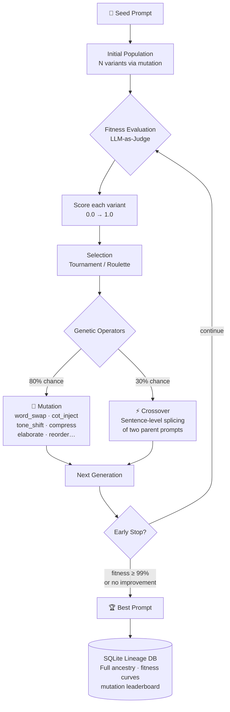
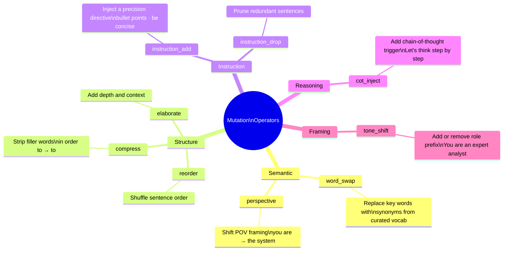
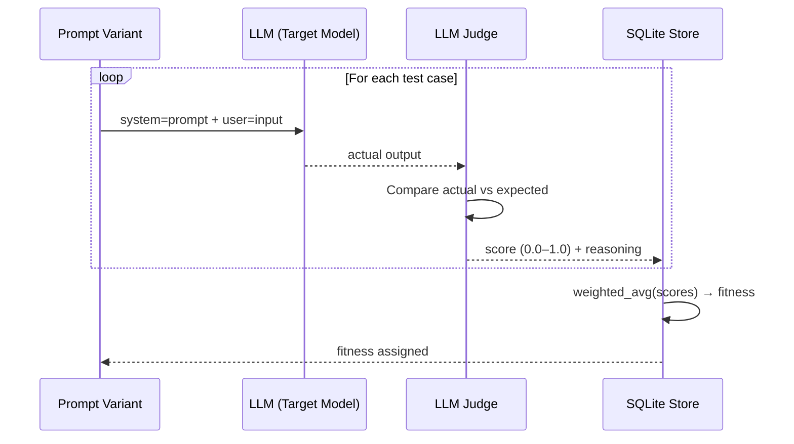
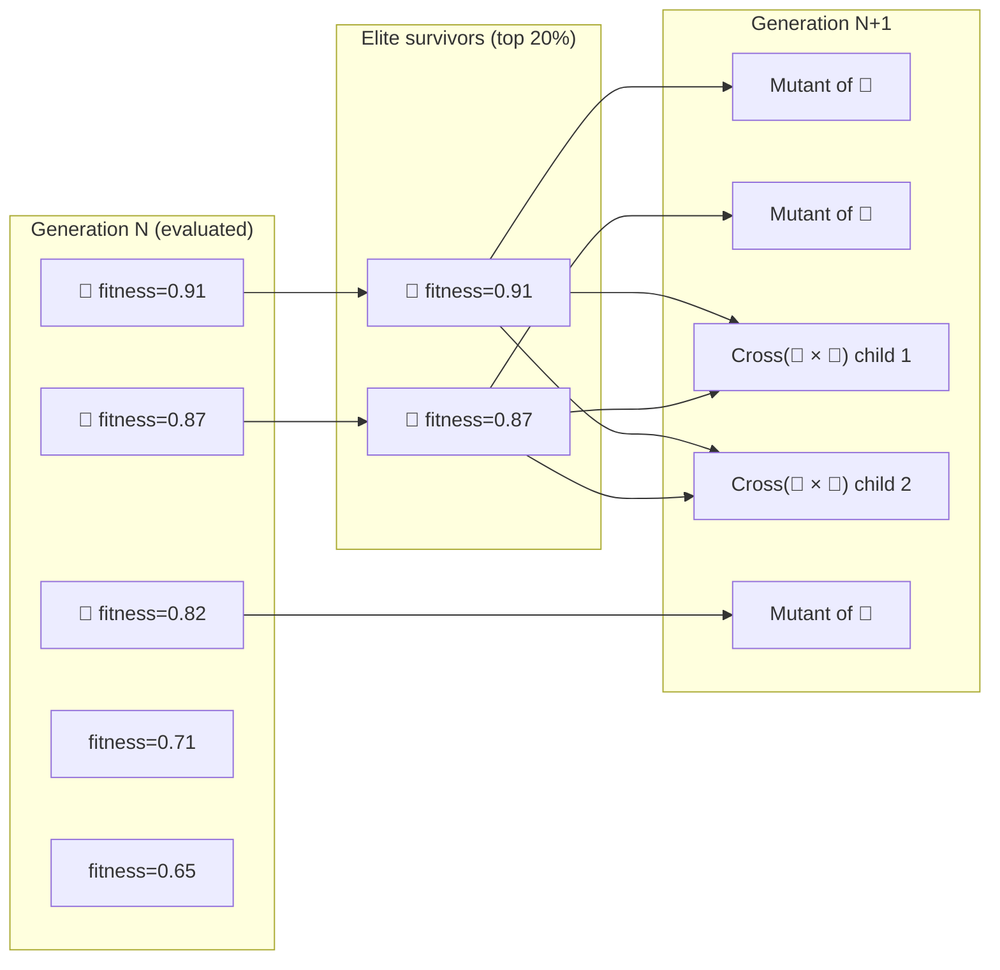
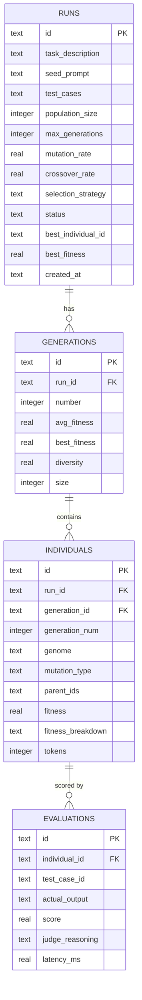
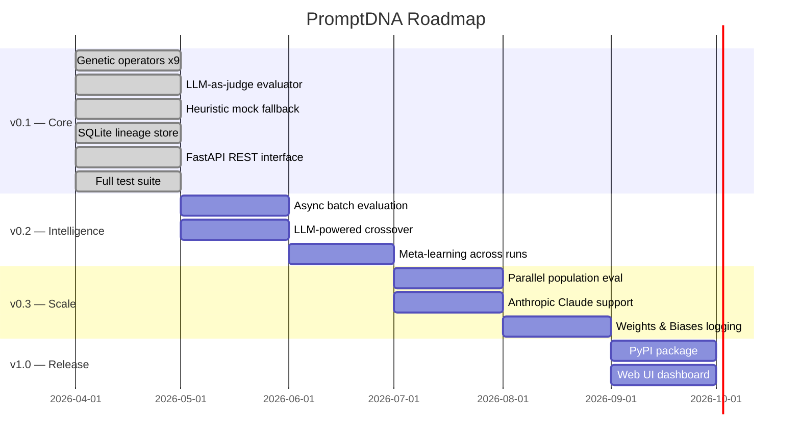

<div align="center">

# 🧬 PromptDNA

### *Prompts are organisms. Evolve the fittest.*

**Genetic algorithm-powered prompt optimization for LLMs.**

[](https://github.com/MAYANK12-WQ/promptdna/actions)
[](https://www.python.org/)
[](LICENSE)
[](https://fastapi.tiangolo.com/)
[](https://www.sqlite.org/)

<br/>

> Prompt engineering is manual trial and error.  
> PromptDNA treats it as an **evolutionary optimization problem**.  
> Your prompt is the seed. Generations of mutation, crossover, and natural selection produce the fittest variant — automatically.

<br/>

</div>

---

## The Insight

In 1859, Darwin showed that complex adaptation emerges from simple rules: **variation + selection + heredity**. No designer, no gradient, no blueprint — just candidates, a way to judge them, and enough generations.

Prompt engineering already looks like this in practice. You write a prompt, read the output, nudge a word, read it again, change the framing, read it again — until it stops being disappointing. That loop is real optimization work. It just isn't usually recognized as one, and it's done by hand, judged by eye, and thrown away the moment it finishes.

**PromptDNA runs that same loop as an algorithm instead of a habit**, and keeps a record of every step it took to get there.

### Why a genetic algorithm, and not something else

This is the decision the rest of the project rests on, so it's worth defending directly.

Prompt space has no gradient. There is no way to differentiate "quality of a summary" with respect to the word *concise* — nothing to take a derivative of, so gradient-based optimization is off the table before you start. The space is also far too large to search exhaustively: the number of meaningfully different phrasings of even a one-line instruction is effectively unbounded.

What *is* available is evaluation: take a candidate prompt, run it, score the result. That single capability — **evaluate, but don't differentiate** — is exactly the shape of problem evolutionary algorithms were built for: rugged, discrete, non-differentiable search spaces where "try it and see" is the only move on the table. Prompt engineering has always been that kind of problem. It just hadn't been treated as one.

The same principles map directly onto what the code actually does:

| Biology | PromptDNA | What it actually is, in code |
|---|---|---|
| Organism | Prompt variant | An `Individual` — a genome string plus fitness, mutation type, and parent ids |
| Genome | Prompt text | The genome string itself, split on sentence boundaries for crossover |
| Fitness | LLM-judged output quality score | Weighted average of per-test-case judge scores, `0.0 – 1.0` |
| Mutation | Word swap, CoT inject, tone shift, reorder… | One of nine functions in `operators.py`, dispatched by `MUTATION_REGISTRY` |
| Crossover | Sentence-level splicing of two parent prompts | `crossover()`: split both parents on sentence boundaries, swap the tails |
| Selection | Tournament / Roulette selection of fittest variants | `tournament_select()` / `roulette_select()` in `evolution.py` |
| Lineage | Full ancestry tree stored in SQLite | Every `Individual` carries `parent_ids`; `store.py` makes the tree queryable |
| Extinction | Low-fitness variants are not carried forward | Non-elite individuals must win a tournament or roulette draw to become a parent |

**Why crossover happens at sentence boundaries, specifically.** `crossover()` splits each parent's genome with `re.split(r'(?<=[.!?])\s+', genome)` — a sentence, not a word or a character, is the unit that gets exchanged. Splicing mid-word or mid-clause produces grammatical rubbish; a sentence is a self-contained instruction (`"You are an expert editor."` is one; `"Answer in under 100 words."` is another), so two decent parents really can hand off whole, coherent instructions to a child. When a parent has fewer than two sentences to cut, `crossover()` doesn't force it — it falls back to mutating each parent instead, rather than producing a nonsensical split.

**Why the least fit individuals don't always disappear immediately.** The top `elite_ratio` of each generation (20% by default, in `EvolutionEngine`) survives into the next generation completely unchanged — that's the part of selection actually named "elitism" in the code. Everyone else has to be bred, and breeding draws its parents from `tournament_select()` or `roulette_select()`, both of which give a lower-fitness individual a real, non-zero chance of being chosen. A population that only ever bred from its single best individual would collapse onto the first local optimum it found and stop improving; giving weaker variants an occasional shot at reproducing is what keeps the search from doing that.

---

## How It Works



---

## Mutation Operators

Nine distinct mutation types, each transforming the prompt in a different way — not arbitrary transformations, but a codification of prompt-engineering folklore that the community already worked out by hand, turned into named, applicable, and above all **measurable** operations.



| Operator | What it does | The folklore it encodes |
|---|---|---|
| `word_swap` | Replaces terms with curated synonyms | Word choice measurably changes model behavior |
| `perspective` | Shifts point-of-view framing | "Explain it as if…" |
| `reorder` | Shuffles sentence sequence | Instruction order matters to the model |
| `compress` | Strips filler language | A shorter prompt is often a sharper one |
| `elaborate` | Adds depth and context | More context beats more cleverness |
| `instruction_add` | Injects a precision directive | Explicit constraints improve output |
| `instruction_drop` | Prunes redundant sentences | Contradictory or redundant instructions hurt |
| `cot_inject` | Adds a chain-of-thought trigger | "Think step by step" |
| `tone_shift` | Adds or removes a role prefix | "You are an expert…" |

Notice the operators come in **opposed pairs** — `compress` against `elaborate`, `instruction_add` against `instruction_drop`. That's deliberate: the algorithm holds no prior belief about which direction actually helps for a given task. It tries both and measures which one wins. That's the quiet substance of the whole project — **it converts anecdote into experiment.**

---

## Fitness Evaluation



**Fitness = weighted average of judge scores across all test cases**

The judge uses this prompt:
```
Score the actual output from 0.0 to 1.0 based on accuracy,
completeness, format adherence, and relevance.
{"score": <float>, "reasoning": "<one sentence>"}
```

No API key? PromptDNA falls back to a **heuristic scorer** based on keyword overlap, length ratio, and prompt structure signals (CoT presence, role framing, format instructions).

> **An honest caveat.** Using a language model to grade a language model's output is the most contested part of this design, and it should be treated that way. Judges carry their own biases — toward length, toward confident phrasing, toward outputs that happen to resemble their own style — and a genetic algorithm is a ruthless optimizer that will happily discover prompts that exploit the judge rather than genuinely serve the task. That's Goodhart's Law with a fast feedback loop.
>
> Two things mitigate this, and neither eliminates it: **multiple, weighted test cases**, which make it considerably harder to satisfy the metric by accident, and the **heuristic scorer**, which offers a cheap, deterministic second opinion to sanity-check a winner. Choose your test cases as carefully as you'd choose an exam — because that's exactly what they are.

---

## Genetic Selection



---

## Quickstart

```bash
git clone https://github.com/MAYANK12-WQ/promptdna.git
cd promptdna
pip install -r requirements.txt

# Run demo (no API key needed — uses mock evaluator)
python examples/basic_usage.py
```

### Basic Usage

```python
from promptdna import PromptOptimizer, TestCase

optimizer = PromptOptimizer(
    api_key="sk-...",          # OpenAI or any compatible API
    model="gpt-4o-mini",
    db_path="my_runs.db",
)

result = optimizer.optimize(
    seed_prompt="Summarize the following text.",
    task_description="Summarize technical articles concisely and accurately",
    test_cases=[
        TestCase(
            input="Large language models use attention mechanisms...",
            expected="LLMs use attention for context modeling.",
            weight=1.0,
        ),
        TestCase(
            input="RAG combines retrieval with generation...",
            expected="RAG grounds LLM output in retrieved documents.",
            weight=1.5,   # this test case matters more
        ),
    ],
    generations=5,
    population_size=10,
)

print(result.best_prompt)
# → "You are an expert analyst. Summarize the following text. Think step by step.
#    Be concise and direct. Provide concrete examples where relevant."

print(f"Fitness: {result.best_fitness:.1%}")
# → Fitness: 87.3%

print(result.summary())
```

### No API Key (Mock Mode)

```python
# Works offline — uses heuristic scoring
optimizer = PromptOptimizer(mock=True)
result = optimizer.optimize(...)
```

---

## Evolutionary Analytics

Most optimization tools hand you an answer and throw away the search that found it. PromptDNA keeps the entire pedigree — every variant, its parents, the operator that produced it, and the fitness it earned — so **the optimized prompt is the product, but the lineage is the research.** You can trace a winning prompt back through its ancestors to the exact mutation, at the exact generation, where its fitness jumped — which turns "trust me, this prompt is better" into something a colleague can actually check.

Query any run at any time:

```python
# Fitness improvement across generations
for row in result.fitness_curve():
    bar = "█" * int(row["best_fitness"] * 30)
    print(f"Gen {row['number']}: {bar} {row['best_fitness']:.4f}")

# Gen 0: ████████████       0.412
# Gen 1: ████████████████   0.541
# Gen 2: ████████████████████ 0.673
# Gen 3: ████████████████████████ 0.798
# Gen 4: ██████████████████████████ 0.871

# Which mutations worked best?
for row in result.mutation_leaderboard():
    print(f"{row['mutation_type']:20s}  avg={row['avg_fitness']:.4f}  best={row['best_fitness']:.4f}")

# cot_inject              avg=0.7821  best=0.8714
# tone_shift              avg=0.7340  best=0.8421
# instruction_add         avg=0.6912  best=0.8102
# word_swap               avg=0.6540  best=0.7890

# Full ancestry of best prompt
for ancestor in result.lineage():
    print(f"Gen {ancestor['generation_num']}  [{ancestor['mutation_type']}]  fitness={ancestor['fitness']}")

# Gen 0  [seed]             fitness=0.412
# Gen 1  [tone_shift]       fitness=0.541
# Gen 2  [cot_inject]       fitness=0.673
# Gen 3  [crossover]        fitness=0.798
# Gen 4  [instruction_add]  fitness=0.871
```

Run PromptDNA across enough tasks and the lineage database stops being a per-run log and starts becoming a dataset about prompting itself — which techniques actually move fitness, and for which kinds of task, backed by evidence instead of folklore.

---

## REST API

```bash
uvicorn api.server:app --reload --port 8081
```

```bash
# Run optimization
curl -X POST http://localhost:8081/optimize \
  -H "Content-Type: application/json" \
  -d '{
    "seed_prompt": "Summarize the following text.",
    "task_description": "Concise technical summarization",
    "test_cases": [
      {"input": "LLMs use attention...", "expected": "LLMs model context via attention.", "weight": 1.0}
    ],
    "generations": 5,
    "population_size": 10
  }'

# List all runs
curl http://localhost:8081/runs

# Fitness curve for a run
curl http://localhost:8081/runs/{run_id}/curve

# Mutation leaderboard
curl http://localhost:8081/runs/{run_id}/mutations

# Top 5 prompts
curl http://localhost:8081/runs/{run_id}/top?n=5

# Lineage of an individual
curl http://localhost:8081/individuals/{individual_id}/lineage
```

---

## Database Schema



---

## Running Tests

```bash
pytest tests/ -v
```

```
tests/test_evolution.py::TestMutationOperators::test_word_swap_returns_string        PASSED
tests/test_evolution.py::TestMutationOperators::test_cot_inject_adds_phrase          PASSED
tests/test_evolution.py::TestMutationOperators::test_compress_shorter_or_equal       PASSED
tests/test_evolution.py::TestMutationOperators::test_mutate_dispatcher               PASSED
tests/test_evolution.py::TestCrossover::test_crossover_produces_two_genomes          PASSED
tests/test_evolution.py::TestCrossover::test_breed_produces_individuals              PASSED
tests/test_evolution.py::TestFitnessEvaluator::test_mock_evaluator_scores_individual PASSED
tests/test_evolution.py::TestFitnessEvaluator::test_cot_prompt_bonus                PASSED
tests/test_evolution.py::TestEvolutionStore::test_save_and_retrieve_run             PASSED
tests/test_evolution.py::TestEndToEnd::test_full_optimization_run                   PASSED
tests/test_evolution.py::TestEndToEnd::test_early_stopping                          PASSED
...
28 passed in 2.81s
```

---

## Roadmap



---

## Project Structure

```
promptdna/
│
├── promptdna/
│   ├── __init__.py         # Public API surface
│   ├── models.py           # Individual, Generation, Run, TestCase dataclasses
│   ├── operators.py        # 9 mutation operators + sentence-level crossover
│   ├── evaluator.py        # LLM-as-judge fitness scoring (+ heuristic fallback)
│   ├── evolution.py        # Genetic algorithm engine (selection, breeding, early stop)
│   ├── store.py            # SQLite WAL store — full lineage, analytics, leaderboards
│   └── optimizer.py        # High-level PromptOptimizer + OptimizationResult API
│
├── api/
│   └── server.py           # FastAPI REST interface
│
├── examples/
│   └── basic_usage.py      # Runnable demo (no API key needed)
│
├── tests/
│   └── test_evolution.py   # 28 pytest unit tests
│
├── .github/workflows/ci.yml
├── requirements.txt
└── README.md
```

---

## Why This Is Different

| Tool | Approach | Limitation |
|---|---|---|
| Manual prompt engineering | Human writes variants | Slow, biased, doesn't scale |
| DSPy | Gradient-like optimization | Requires labeled datasets, complex setup |
| PromptPerfect | Black-box SaaS | No lineage, no analytics, vendor lock-in |
| **PromptDNA** | Genetic algorithm + full lineage | Open-source, local, queryable ancestry |

The key insight: **you don't need gradients to optimize discrete text**. Evolutionary search is more robust to the rugged fitness landscape of natural language.

---

## Where It Fits, and Where It Doesn't

**Use it when** you have a prompt that will run many times in production — a classifier, a summarizer, an extraction step, a grading assistant — and you can write test cases that actually define what a good answer looks like. The cost of optimization is paid once, up front; the benefit is paid back on every call afterward.

**Don't reach for it when** the task is genuinely one-off, when "good" can't be pinned down concretely enough to score, or when you only have a handful of test cases to evaluate against. A thin test set gets overfit precisely — as any optimizer, genetic or otherwise, will do to whatever you hand it.

**Be aware that** cost scales roughly as `population_size × generations × test_cases` in model calls, on both the target model and the judge. Start small, watch the fitness curve in `result.fitness_curve()`, and let early stopping do its job before scaling up.

---

<div align="center">

Built with 🧬 by [Mayank Shekhar](https://github.com/MAYANK12-WQ)

*If natural selection can build an eye from scratch, it can find your best prompt.*

⭐ Star this repo if you found it useful

</div>
