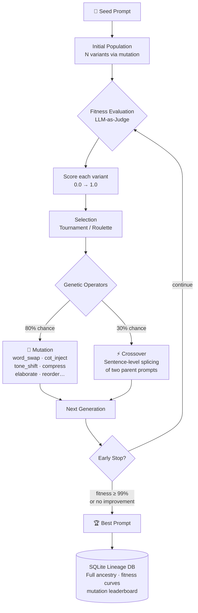
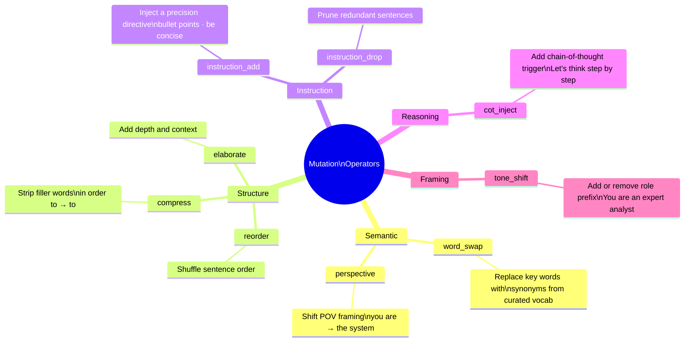
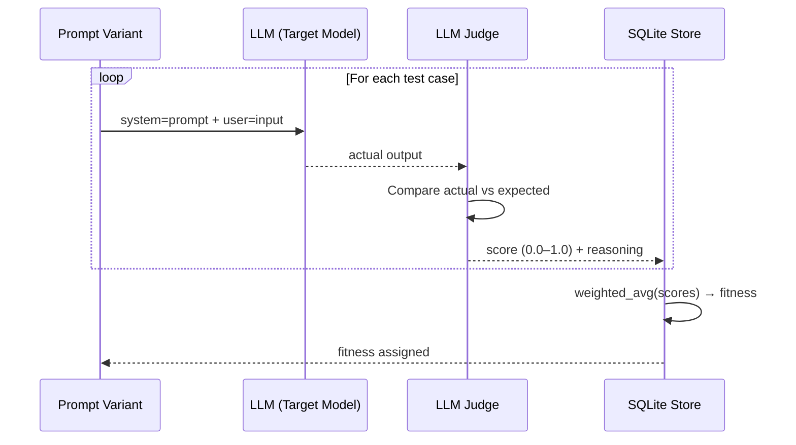
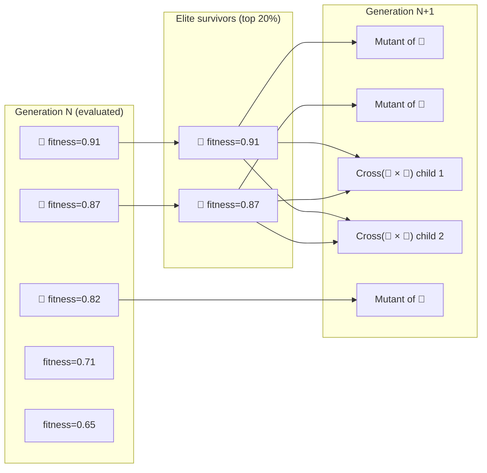
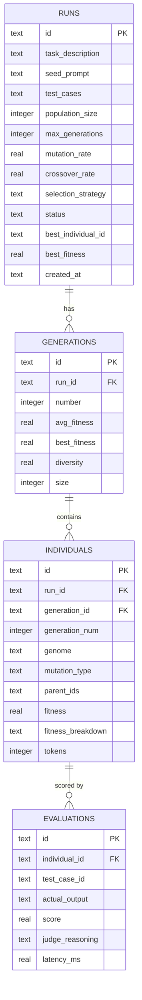
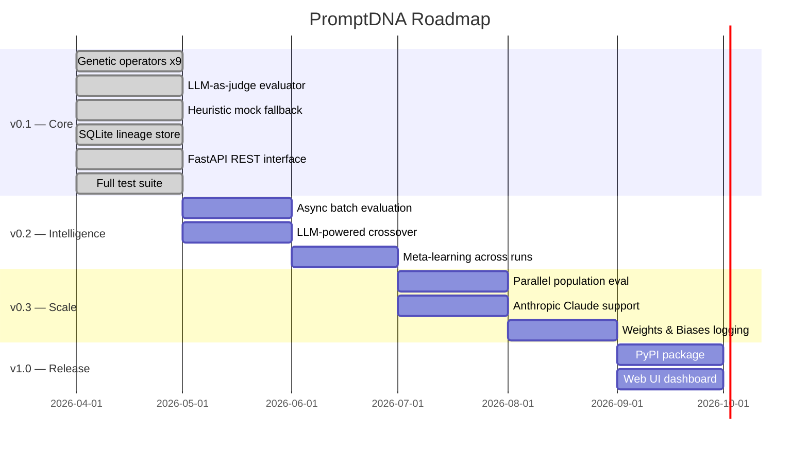

<div align="center">

# 🧬 PromptDNA

### *Prompts are organisms. Evolve the fittest.*

**Genetic algorithm-powered prompt optimization for LLMs.**

[](https://github.com/MAYANK12-WQ/promptdna/actions)
[](https://www.python.org/)
[](LICENSE)
[](https://fastapi.tiangolo.com/)
[](https://www.sqlite.org/)

<br/>

> Prompt engineering is manual trial and error.  
> PromptDNA treats it as an **evolutionary optimization problem**.  
> Your prompt is the seed. Generations of mutation, crossover, and natural selection produce the fittest variant — automatically.

<br/>

</div>

---

## The Insight

In 1859, Darwin showed that complex adaptation emerges from simple rules: **variation + selection + heredity**.

The same principles apply to prompts:

| Biology | PromptDNA |
|---|---|
| Organism | Prompt variant |
| Genome | Prompt text |
| Fitness | LLM-judged output quality score |
| Mutation | Word swap, CoT inject, tone shift, reorder… |
| Crossover | Sentence-level splicing of two parent prompts |
| Selection | Tournament / Roulette selection of fittest variants |
| Lineage | Full ancestry tree stored in SQLite |
| Extinction | Low-fitness variants are not carried forward |

---

## How It Works



---

## Mutation Operators

Nine distinct mutation types — each transforms the prompt in a different way:



---

## Fitness Evaluation



**Fitness = weighted average of judge scores across all test cases**

The judge uses this prompt:
```
Score the actual output from 0.0 to 1.0 based on accuracy,
completeness, format adherence, and relevance.
{"score": <float>, "reasoning": "<one sentence>"}
```

No API key? PromptDNA falls back to a **heuristic scorer** based on keyword overlap, length ratio, and prompt structure signals (CoT presence, role framing, format instructions).

---

## Genetic Selection



---

## Quickstart

```bash
git clone https://github.com/MAYANK12-WQ/promptdna.git
cd promptdna
pip install -r requirements.txt

# Run demo (no API key needed — uses mock evaluator)
python examples/basic_usage.py
```

### Basic Usage

```python
from promptdna import PromptOptimizer, TestCase

optimizer = PromptOptimizer(
    api_key="sk-...",          # OpenAI or any compatible API
    model="gpt-4o-mini",
    db_path="my_runs.db",
)

result = optimizer.optimize(
    seed_prompt="Summarize the following text.",
    task_description="Summarize technical articles concisely and accurately",
    test_cases=[
        TestCase(
            input="Large language models use attention mechanisms...",
            expected="LLMs use attention for context modeling.",
            weight=1.0,
        ),
        TestCase(
            input="RAG combines retrieval with generation...",
            expected="RAG grounds LLM output in retrieved documents.",
            weight=1.5,   # this test case matters more
        ),
    ],
    generations=5,
    population_size=10,
)

print(result.best_prompt)
# → "You are an expert analyst. Summarize the following text. Think step by step.
#    Be concise and direct. Provide concrete examples where relevant."

print(f"Fitness: {result.best_fitness:.1%}")
# → Fitness: 87.3%

print(result.summary())
```

### No API Key (Mock Mode)

```python
# Works offline — uses heuristic scoring
optimizer = PromptOptimizer(mock=True)
result = optimizer.optimize(...)
```

---

## Evolutionary Analytics

Every run is stored with full lineage. Query it any time:

```python
# Fitness improvement across generations
for row in result.fitness_curve():
    bar = "█" * int(row["best_fitness"] * 30)
    print(f"Gen {row['number']}: {bar} {row['best_fitness']:.4f}")

# Gen 0: ████████████       0.412
# Gen 1: ████████████████   0.541
# Gen 2: ████████████████████ 0.673
# Gen 3: ████████████████████████ 0.798
# Gen 4: ██████████████████████████ 0.871

# Which mutations worked best?
for row in result.mutation_leaderboard():
    print(f"{row['mutation_type']:20s}  avg={row['avg_fitness']:.4f}  best={row['best_fitness']:.4f}")

# cot_inject              avg=0.7821  best=0.8714
# tone_shift              avg=0.7340  best=0.8421
# instruction_add         avg=0.6912  best=0.8102
# word_swap               avg=0.6540  best=0.7890

# Full ancestry of best prompt
for ancestor in result.lineage():
    print(f"Gen {ancestor['generation_num']}  [{ancestor['mutation_type']}]  fitness={ancestor['fitness']}")

# Gen 0  [seed]             fitness=0.412
# Gen 1  [tone_shift]       fitness=0.541
# Gen 2  [cot_inject]       fitness=0.673
# Gen 3  [crossover]        fitness=0.798
# Gen 4  [instruction_add]  fitness=0.871
```

---

## REST API

```bash
uvicorn api.server:app --reload --port 8081
```

```bash
# Run optimization
curl -X POST http://localhost:8081/optimize \
  -H "Content-Type: application/json" \
  -d '{
    "seed_prompt": "Summarize the following text.",
    "task_description": "Concise technical summarization",
    "test_cases": [
      {"input": "LLMs use attention...", "expected": "LLMs model context via attention.", "weight": 1.0}
    ],
    "generations": 5,
    "population_size": 10
  }'

# List all runs
curl http://localhost:8081/runs

# Fitness curve for a run
curl http://localhost:8081/runs/{run_id}/curve

# Mutation leaderboard
curl http://localhost:8081/runs/{run_id}/mutations

# Top 5 prompts
curl http://localhost:8081/runs/{run_id}/top?n=5

# Lineage of an individual
curl http://localhost:8081/individuals/{individual_id}/lineage
```

---

## Database Schema



---

## Running Tests

```bash
pytest tests/ -v
```

```
tests/test_evolution.py::TestMutationOperators::test_word_swap_returns_string        PASSED
tests/test_evolution.py::TestMutationOperators::test_cot_inject_adds_phrase          PASSED
tests/test_evolution.py::TestMutationOperators::test_compress_shorter_or_equal       PASSED
tests/test_evolution.py::TestMutationOperators::test_mutate_dispatcher               PASSED
tests/test_evolution.py::TestCrossover::test_crossover_produces_two_genomes          PASSED
tests/test_evolution.py::TestCrossover::test_breed_produces_individuals              PASSED
tests/test_evolution.py::TestFitnessEvaluator::test_mock_evaluator_scores_individual PASSED
tests/test_evolution.py::TestFitnessEvaluator::test_cot_prompt_bonus                PASSED
tests/test_evolution.py::TestEvolutionStore::test_save_and_retrieve_run             PASSED
tests/test_evolution.py::TestEndToEnd::test_full_optimization_run                   PASSED
tests/test_evolution.py::TestEndToEnd::test_early_stopping                          PASSED
...
28 passed in 2.81s
```

---

## Roadmap



---

## Project Structure

```
promptdna/
│
├── promptdna/
│   ├── __init__.py         # Public API surface
│   ├── models.py           # Individual, Generation, Run, TestCase dataclasses
│   ├── operators.py        # 9 mutation operators + sentence-level crossover
│   ├── evaluator.py        # LLM-as-judge fitness scoring (+ heuristic fallback)
│   ├── evolution.py        # Genetic algorithm engine (selection, breeding, early stop)
│   ├── store.py            # SQLite WAL store — full lineage, analytics, leaderboards
│   └── optimizer.py        # High-level PromptOptimizer + OptimizationResult API
│
├── api/
│   └── server.py           # FastAPI REST interface
│
├── examples/
│   └── basic_usage.py      # Runnable demo (no API key needed)
│
├── tests/
│   └── test_evolution.py   # 28 pytest unit tests
│
├── .github/workflows/ci.yml
├── requirements.txt
└── README.md
```

---

## Why This Is Different

| Tool | Approach | Limitation |
|---|---|---|
| Manual prompt engineering | Human writes variants | Slow, biased, doesn't scale |
| DSPy | Gradient-like optimization | Requires labeled datasets, complex setup |
| PromptPerfect | Black-box SaaS | No lineage, no analytics, vendor lock-in |
| **PromptDNA** | Genetic algorithm + full lineage | Open-source, local, queryable ancestry |

The key insight: **you don't need gradients to optimize discrete text**. Evolutionary search is more robust to the rugged fitness landscape of natural language.

---

<div align="center">

Built with 🧬 by [Mayank Shekhar](https://github.com/MAYANK12-WQ)

*If natural selection can build an eye from scratch, it can find your best prompt.*

⭐ Star this repo if you found it useful

</div>
